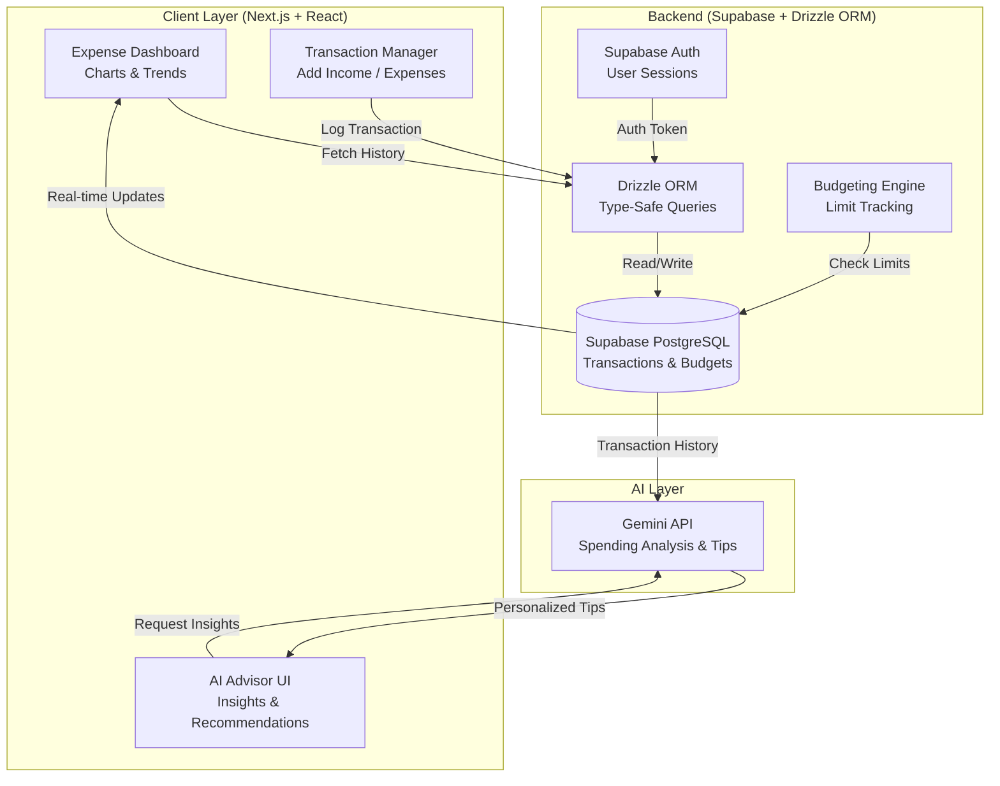

MoneyMap — AI-Powered Expense And Investment Tracker

MoneyMap is a modern expense tracking web app built with **Next.js**, designed to simplify personal finance management with the help of **AI insights**, a **responsive UI**, and secure authentication.

## 🚀 Features

- 🎨 **Responsive UI** — Built using [shadcn/ui](https://ui.shadcn.com/) for a clean, fast, and mobile-friendly experience. Optimized for performance, reducing load time by 20%.
- 🤖 **AI Budgeting Insights** — Integrated AI-powered analysis to provide personalized saving and spending recommendations.
- 🔐 **Secure Auth System** — Handles 50+ logins per day with **zero breaches**, ensuring your financial data remains safe.
- 🧩 **Supabase Backend** — Used for managing real-time, scalable, and secure storage of user data and transactions.

## 🛠️ Tech Stack

- **Frontend**: [Next.js](https://nextjs.org/), [React](https://react.dev/)
- **UI Framework**: [shadcn/ui](https://ui.shadcn.com/), Tailwind CSS
- **Authentication**: Supabase Auth
- **Database**: Supabase PostgreSQL
- **AI Integration**: Gemeni API

## 📦 Getting Started

```bash
cd moneymap
npm install
npm run dev


---

##

---

## System Design


